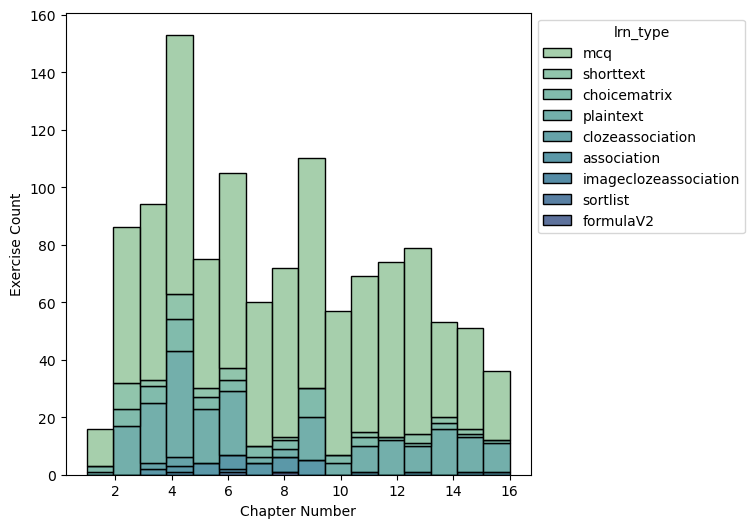
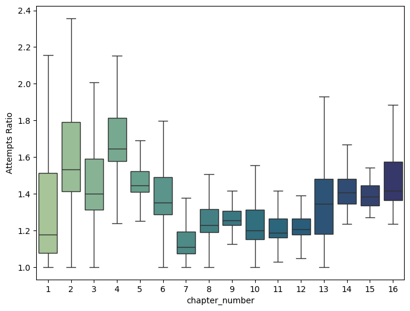
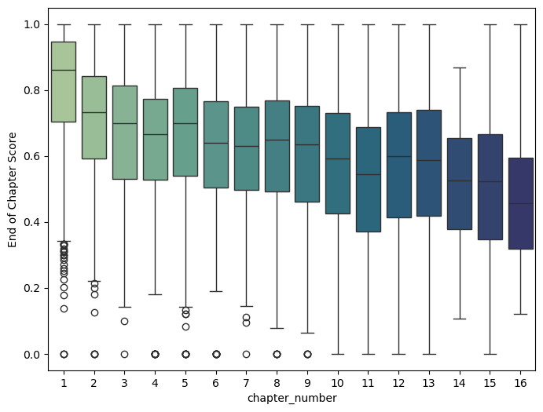

# American Statistical Association Duke DataFest

The distributed dataset was by CourseKata, an online textbook to learn statistics and data science. There are 16 chapters in the textbook with exercises and an end of chapter assessment. Questions can be reattempted. 

|  |  |
| :-: | :-: |
| **Figure 1**: Distribution of exercises in the 16 chapters of the textbook | **Figure 2** : Attempt ratio with respect to total number of questions in each chapter

Through this challenge, I was interested in seeing if allocation of study time on sections in a chapter would affect performance on the review pages at the end of the chapter. 

| | 
| :-: | :-: |
| **Figure 3**: Distribution of end of chapter scores for every chapter | **Figure 4**: Scatterplot of end of chapter score vs attempt ratio |

## Preprocessing
When preprocessing the data, I saw that there was a wide variance among students and their study habits, evident through CourseKata's different metrics. Three of these metrics quantifying the time students spent on the textbook were through the engagement, idle and off page time. However, these metrics are to be taken with a grain fo salt. Students would open multiple tabs of the textbook at once, causing CourseKata to count against their engagement, but the students may be actively studying in one of the tabs. 

To simplify analysis, only engagement time of each page view was considered, to make sure that students were indeed on the page when engaging with the content. Time spent on the end of chapter pages were also not considered as I was only interested in their engagement/studying of the material. 

| |
| :-: |
| **Figure 5**: Distributions of engagement for each chapter of the CourseKata textbook |

## Non-Linear Dimension Reduction
I implemented Isomap to conduct non-linear dimension reduction. I wanted to use a non-linear dimension reduction technique that would still preserve global distances to see if further analysis could be conducted.

|  |  |
|:-:|:-:|
|**Figure 6**: 2-Component Isomap Embedding of Chapter 1| **Figure 7**: 2-Component Isomap Embedding of Chapter 2|

|  |  |
|:-:|:-:|
|**Figure 8**: 2-Component Isomap Embedding of Chapter 3| **Figure 9**: 2-Component Isomap Embedding of Chapter 4|

|  |  |
|:-:|:-:|
|**Figure 10**: 2-Component Isomap Embedding of Chapter 5| **Figure 11**: 2-Component Isomap Embedding of Chapter 6|

|  |  |
|:-:|:-:|
|**Figure 12**: 2-Component Isomap Embedding of Chapter 7| **Figure 13**: 2-Component Isomap Embedding of Chapter 8|

|  |  |
|:-:|:-:|
|**Figure 14**: 2-Component Isomap Embedding of Chapter 9| **Figure 15**: 2-Component Isomap Embedding of Chapter 10|

|  |  |
|:-:|:-:|
|**Figure 16**: 2-Component Isomap Embedding of Chapter 11| **Figure 17**: 2-Component Isomap Embedding of Chapter 12|

|  |  |
|:-:|:-:|
|**Figure 18**: 2-Component Isomap Embedding of Chapter 13| **Figure 19**: 2-Component Isomap Embedding of Chapter 14|

|  |  |
|:-:|:-:|
|**Figure 20**: 2-Component Isomap Embedding of Chapter 15| **Figure 21**: 2-Component Isomap Embedding of Chapter 16|